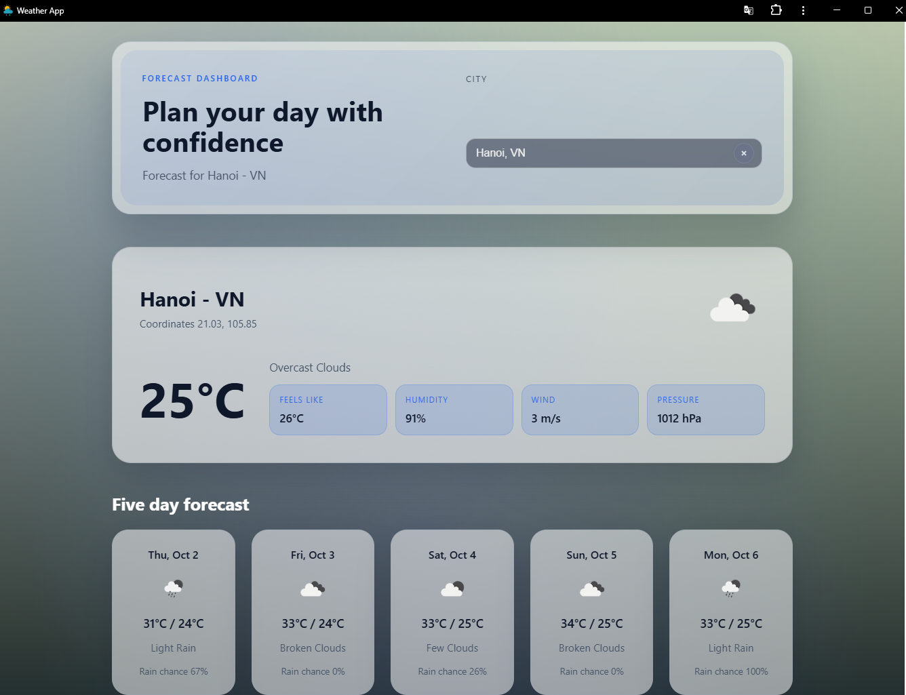

# 🌤️ Weather Dashboard (React + PWA)

A progressive web application that displays **current weather** and a **5-day forecast**, supports **city search**, and works **offline** thanks to PWA.

---

## 📷 Screenshot

---

## 🚀 Key Features
- **Search City**: look up cities using OpenWeather **Geocoding API** (real-time with debounce).
- **Current Weather**: show temperature, conditions, humidity, pressure, wind speed.
- **5-day Forecast**: aggregate 3-hour data into daily summaries (min/max + icon).
- **Persist Last City**: remember the last searched city.
- **PWA / Offline**:
  - Cache HTML/CSS/JS so the app can run offline.
  - Cache `weather` + `forecast` data for display when the network is unavailable.
  - **Do not cache Geocoding API** (city search is disabled offline).
- Basic UI.

---

## 🛠️ Technologies
- [React](https://react.dev/)
- [OpenWeather API](https://openweathermap.org/api)  
  - **Geocoding API**  
  - **Current Weather API**  
  - **5-day / 3-hour Forecast API**
- Service Worker (PWA with cache-first + network-first strategies)
- localStorage (last city)

---
## 🎬 Demo
[▶ Watch the demo](./docs/demo.mp4)